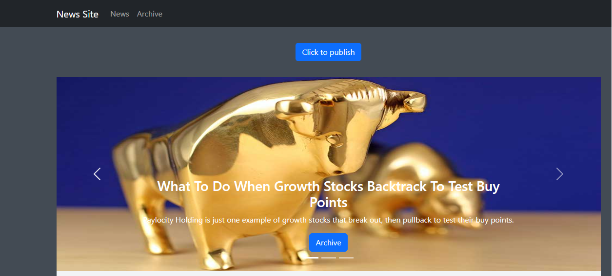
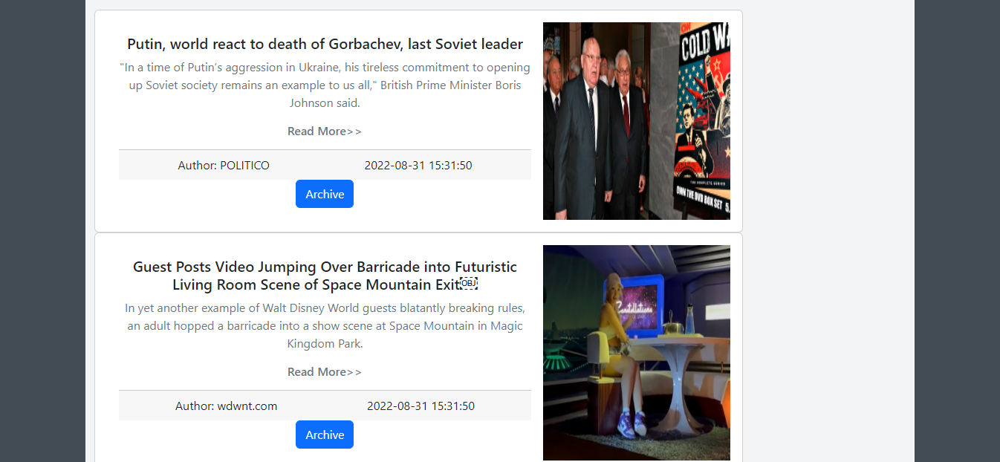
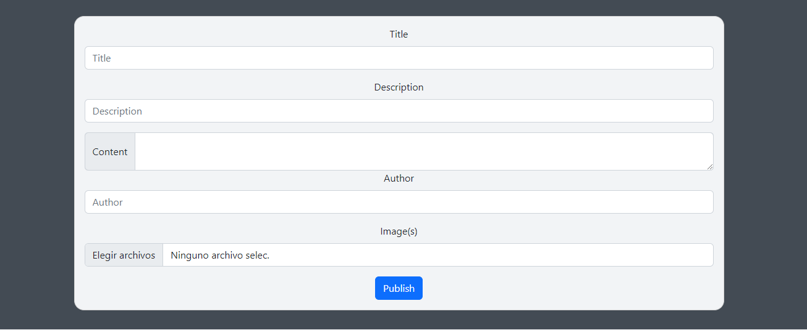

# News test 
## MAIN TECHNOLOGIES 🛠️
- Javascript
- React
- Redux
- React Bootstrap
## Available Scripts

In the project directory, run:

### `npm install`
### `npm start`

Runs the app in the development mode.\
Open [http://localhost:3000](http://localhost:3000) to view it in your browser.

The page will reload when you make changes.\
You may also see any lint errors in the console.

## Some features
* Publish news(from news view).
* Archhive news(from news view).
* Remove news(from archive view).
* Read more.
### Views
* News view
* Archive view
* News detail view
* 404 Page not found.

### Images
Top 3 news:

Cards

Publish form

News detail

## Author ✒️
* **Ivan Puebla** - *The Bridge* - [ivanpuebla10](https://github.com/ivanpuebla10)
